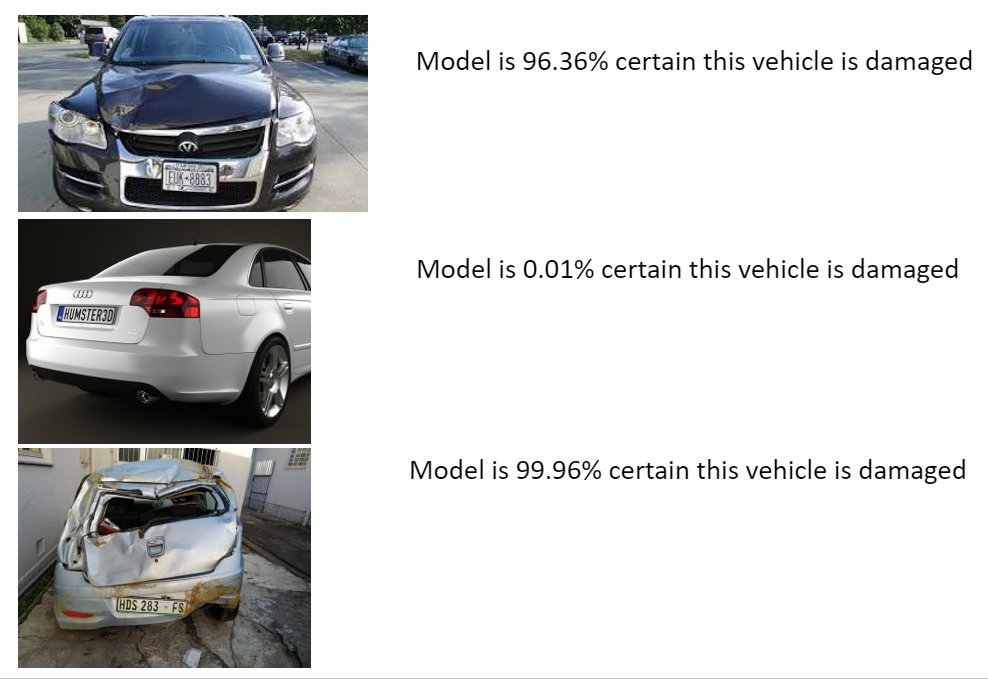

# Machine-Learning-Comp

The Data and Analytics team at TIH setup an internal competition to classify images of vehicles as either damaged or not damaged using a predefined set of images.

My entry was the winning entry for the competition.  I used transfer learning and an ensemble of two models, one based on Xception and another based on InceptionV3 to classify the vehicles images. 

